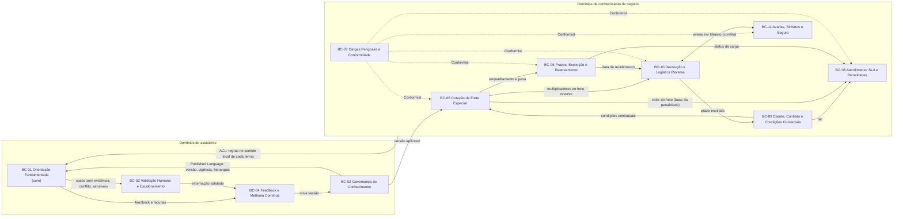

# NovaTech · Assistente de IA com RAG — Recorte de Domínio (v1)

| Item | Conteúdo |
| --- | --- |
| Documento | 01-bounded-contexts-v1 |
| Escopo | Somente recorte de domínio: bounded contexts de negócio e linguagem ubíqua |
| Fora deste documento | Arquitetura, divisão técnica, requisitos, chunking, modelo |
| Fonte de verdade | `anexo-a-documentacao-simulada-novatech.md` (Anexo A) |
| Data | 24/09/2026 |
| Status | Rascunho para validação com Produto, Comercial, Operações, Compliance e Atendimento |

---

## 0. Registro de revisão

| Rev. | Data | Base | O que mudou |
| --- | --- | --- | --- |
| 0 | 24/09/2026 | Artefatos derivados (transcrições das Etapas 2 e 3, resumos de POL-001 e SLA-2024), sem o Anexo A | Primeira versão do recorte |
| 1 | 24/09/2026 | **Anexo A**, lido na íntegra | Recorte e glossário refeitos com a fonte de verdade. Mudanças principais abaixo |
| 1.1 | 24/09/2026 | Anexo A + rev. 0 | Consolidação: reincorporadas as referências à Jornada (princípio central, guardrails G1–G6, raias F e R), termos principais por context, pendências de dono e os apêndices A (rastreabilidade rev. 0 → rev. 1) e B (cobertura das notas do Anexo A) |

**Principais mudanças da rev. 1 em relação à rev. 0**

- **A PROC-042 v2 existe no Anexo A** (versão 2.0, emitida em 10/11/2023). Isso contradiz a conclusão registrada nos artefatos anteriores de que a v2 "não existe". A DP-03 da ESPEC-V2 fica respondida: a v2 faz parte da fonte de verdade.
- **Termos que deixaram de ser AMBIGUIDADE:**
  - carga perigosa (classes 1 a 6 da ANTT, na POL-001);
  - critérios de tier Gold/Silver/Standard (SLA-2024);
  - inexistência de outros tiers ("Platinum"), agora com fonte formal;
  - evento de recebimento (data confirmada no tracking);
  - dias úteis (excluem sábados, domingos e feriados nacionais);
  - prazos e critérios de incidente crítico;
  - quebra da cadeia de frio (30 minutos contínuos fora da faixa);
  - origem do limiar de 5.000 kg (presente na v1 e na v2; a DP-27 fica respondida).
- **Conflitos novos:** v1 × v2 em multiplicadores, fator de peso, prazo adicional e desconto; POL-001 × FAQ #38 sobre avaria em trânsito.
- **Ambiguidades novas:** a regra de transição da v2 cita só multiplicadores; o desconto da v2 incide "sobre o multiplicador regional"; o relógio de SLA não tem regra explícita para incidente crítico de Silver e Standard; "reembolso" e "crédito" têm mais de um sentido.
- **Contexts ajustados:** BC-06 passa a fornecer a data de recebimento ao BC-10; BC-08 incorpora penalidades e disponibilidade do portal; BC-10 incorpora devolução parcial, custos e frete reverso.

### Convenção de fontes

Cada afirmação cita o documento e a seção do Anexo A, por exemplo `POL-001 §3.2`. As "Notas sobre a documentação" do Anexo A são meta-informação dos exercícios e são citadas como `Anexo A · Notas`; não são regra de negócio.

| Código | Documento | Versão / data | Responsável | Classificação declarada |
| --- | --- | --- | --- | --- |
| `POL-001` | Política de Devolução de Mercadorias | 3.1 · 15/01/2024 | Diretoria de Operações | Normativo, uso obrigatório pelo atendimento |
| `PROC-042 v1` | Cálculo de Frete Especial | 1.0 · 03/03/2023 | Diretoria Comercial | Sem indicação de vigência; coexiste com a v2 |
| `PROC-042 v2` | Cálculo de Frete Especial (Revisado) | 2.0 · 10/11/2023 | Diretoria Comercial | Sem indicação de que substitui a v1 |
| `SLA-2024` | Tabela de SLA por Tipo de Cliente | 2024.1 · 02/01/2024 | Diretoria Comercial + Diretoria de Operações | Contratual, compromisso formal com o cliente |
| `FAQ #n` | FAQ-Atendimento (9 de 47 itens) | Não controlada | Nenhum responsável formal | **Informal**, não validado |
| `JORNADA` | Jornada integrada do atendente (PDF) | — | Produto | Artefato de produto: princípio central, guardrails G1–G6, raias e caminhos |
| `ESPEC-V2` | Especificação de Requisitos V2 | — | Produto | Artefato de produto: glossário (seção 4) e decisões pendentes (seção 16) |

`JORNADA` e `ESPEC-V2` não são fonte de regra de negócio. Eles sustentam apenas os contexts do próprio assistente (BC-01 a BC-04) e os termos do produto (seção 3.3).

---

## 1. Visão geral do recorte

O assistente vive na interseção de dois tipos de domínio:

1. **Domínios de conhecimento de negócio**, que são os assuntos sobre os quais o atendente pergunta. Cada um tem documento, dono e vocabulário próprios.
2. **Domínios do próprio assistente**, que tratam de *como* uma orientação pode ser dada com segurança: autoridade da fonte, evidência, validação humana e melhoria da base.

O diferencial do produto não é conhecer as regras, que pertencem às áreas, e sim **responder somente com evidência e saber quando não responder**. O Anexo A torna isso central: dois documentos formais do mesmo procedimento coexistem sem hierarquia, e o FAQ contradiz ambos.

| # | Bounded context | Tipo de subdomínio | Dono segundo o Anexo A |
| --- | --- | --- | --- |
| BC-01 | Orientação Fundamentada ao Atendente | **Core** | Não se aplica (produto) |
| BC-02 | Governança do Conhecimento | **Core** (de suporte ao BC-01) | AMBIGUIDADE: não há curador; o FAQ não tem responsável |
| BC-03 | Validação Humana e Escalonamento | Suporte | Áreas donas de cada documento |
| BC-04 | Feedback e Melhoria Contínua | Suporte | AMBIGUIDADE: não definido |
| BC-05 | Cotação de Frete Especial | Negócio | Diretoria Comercial (`PROC-042 v1` e `v2`) |
| BC-06 | Prazos, Execução e Rastreamento | Negócio | Operações (gerente de operações regional) |
| BC-07 | Cargas Perigosas e Conformidade | Negócio | Compliance (revisa a PROC-043) e Gestão de Riscos (exceções); sem documento próprio no corpus |
| BC-08 | Atendimento, SLA e Penalidades | Negócio | Diretoria Comercial + Diretoria de Operações (`SLA-2024`) |
| BC-09 | Cliente, Contrato e Condições Comerciais | Negócio | Comercial / Diretoria Comercial |
| BC-10 | Devolução e Logística Reversa | Negócio | Diretoria de Operações (`POL-001`) |
| BC-11 | Avarias, Sinistros e Seguro | Negócio | AMBIGUIDADE: só há fonte informal; o FAQ cita o Jurídico |

### Decisões de recorte

- **O PROC-042 foi dividido entre quatro contexts.** Cálculo (BC-05), prazo e aprovação de carga pesada (BC-06), carga perigosa (BC-07) e desconto (BC-09) têm decisores diferentes, embora estejam no mesmo documento.
- **As duas versões do PROC-042 pertencem ao mesmo context.** Versão é assunto do BC-02; o BC-05 recebe a indicação de qual versão se aplica.
- **SLA ficou separado de prazo de entrega.** No `SLA-2024`, "SLA" mede o atendimento de chamados e a disponibilidade do portal, nunca o prazo de entrega da carga.
- **Carga perigosa tem context próprio.** A definição formal está na POL-001, mas afeta frete, prazo, SLA, devolução e seguro. Em todos esses usos a regra detalhada está fora do corpus (PROC-043 ausente e em revisão).
- **Avaria virou context próprio, com fronteira em disputa.** A POL-001 cita "avaria em trânsito" como motivo de devolução sem custo; o FAQ #38 diz que carga danificada segue processo diferente, via Jurídico.
- **O FAQ não é um context.** É uma fonte informal cujos itens se distribuem pelos contexts de negócio; sua autoridade é classificada no BC-02.
- **Frete padrão (abaixo de 500 kg) e interceptação de carga em trânsito (PROC-088) não viraram contexts.** São citados, mas não documentados no corpus (`Anexo A · Notas`, gap 3; `POL-001 §2`). O assistente deve tratá-los como fora de cobertura.

---

## 2. Bounded contexts

### BC-01 · Orientação Fundamentada ao Atendente (core)

**Responsabilidade:** transformar a dúvida do atendente em orientação sustentada por evidência documental, tornando explícitas a incerteza, o conflito e a necessidade de validação humana. Materializa o princípio central da `JORNADA`: *responder com base na documentação; sem evidência suficiente, não assumir e direcionar para validação*.

**Dentro:**
- Dúvida do atendente e sua interpretação.
- Identificação do context de negócio que detém a regra.
- Pedido de dado do caso que falta: peso, tier, região de destino, tipo e classe da carga, data de abertura do chamado, data do contrato, número do CT-e.
- Situação da resposta: completa, parcial, sem evidência, baixa evidência, conflito.
- Nível de confiança baseado na qualidade da evidência.
- Citação de documento, seção, versão e vigência (`JORNADA` G3).
- Reconhecimento de conflito entre fontes, mostrando as duas sem escolher sozinho (`JORNADA` G4).
- Reconhecimento de tema sensível (`JORNADA` G5).
- Fallback sem suposições: não criar, completar ou presumir prazo, valor de frete, taxas, indenização, cobertura de seguro ou janela de coleta (`JORNADA` G1 e F1).
- Proteção de dados do cliente na orientação: não expor CPF, endereço ou dados do destinatário (`JORNADA` G6).
- Registro de concordância ou discordância do atendente.

**Fora:**
- Criar ou alterar regra de negócio.
- Decidir vigência, versão ou autoridade de documento (BC-02).
- Conceder desconto, aprovar carga acima de 5.000 kg, autorizar exceção de carga perigosa.
- Informar status real de carga, que vem do tracking (BC-06; `JORNADA` G2).
- Comunicação final ao cliente, que permanece com o atendente.
- Tratamento do feedback depois de registrado (BC-04).

**Termos principais:** situação da resposta, evidência, confiança, interpretação permitida, inferência, data de referência (seção 3.3).

**Relação com os demais:**
- **BC-02 → BC-01 (Conformist):** aceita a classificação de fonte e versão sem reinterpretá-la.
- **BC-05 a BC-11 → BC-01 (Anticorruption Layer):** preserva o sentido local de cada termo. "Crédito" no BC-10 não é "crédito" no BC-08.
- **BC-01 → BC-03 e BC-04 (Customer-Supplier).**

---

### BC-02 · Governança do Conhecimento

**Responsabilidade:** determinar o que pode ser usado como fonte, com qual autoridade e para qual período.

**Dentro:**
- Inventário das fontes e atributos: versão, data, responsável, classificação.
- Distinção entre documento normativo (`POL-001`), contratual (`SLA-2024`), procedimento sem vigência declarada (`PROC-042 v1` e `v2`) e informal (`FAQ`).
- Coexistência de versões sem hierarquia: v1 e v2 estão ativas, nenhuma marcada como obsoleta.
- Regra de transição declarada na `PROC-042 v2 §5`.
- Registro de conflitos conhecidos (`Anexo A · Notas`, contradições 1 a 4, e POL-001 × FAQ #38).
- Registro de documentos citados e ausentes: PROC-043, PROC-088, tabela mensal de fretes, tabela de prazo padrão por rota, tabela de frete padrão.
- Retirada de versões vencidas das respostas correntes, sem apagar histórico (`JORNADA` R0 e R6).

**Fora:**
- Conteúdo das regras; decidir qual regra está certa, que cabe ao dono.
- Responder dúvidas (BC-01).

**Termos principais:** fonte oficial, fonte informal, documento sem vigência confirmada, conflito documental (seção 3.3); versão aplicável do PROC-042 (T-12).

**Relação com os demais:**
- **BC-02 → BC-01 (Published Language).**
- **BC-05 a BC-11 → BC-02 (Customer-Supplier):** donos fornecem documentos e confirmam vigência.
- **BC-04 → BC-02 (Customer-Supplier):** recebe versões corrigidas.

---

### BC-03 · Validação Humana e Escalonamento

**Responsabilidade:** levar ao responsável certo os casos que o assistente não pode resolver e devolver informação validada.

**Dentro:**
- Gatilhos: informação não encontrada, baixa confiança, conflito entre fontes, discordância do atendente (`JORNADA` F1), tema sensível.
- Temas que sempre exigem pessoa: avaria, extravio, indenização, carga perigosa, reclamação formal e exceção contratual (`JORNADA` G5). O baseline da ESPEC-V2 acrescenta descontos, seguro, exceções de devolução e incidentes críticos, com nível de intervenção N1, N2 ou N3 ainda pendente (DP-08).
- Destinos que o próprio Anexo A nomeia:
  - Gestão de Riscos, ramal 4500, para cargas fora da devolução padrão (`POL-001 §3.2`);
  - Comercial, para devolução com prazo expirado (`POL-001 §3.5`) e SLA fora dos tiers (`SLA-2024 §1`);
  - Diretoria Comercial, para desconto acima dos percentuais (`PROC-042 v2 §4`);
  - gerente de operações regional, para cargas acima de 5.000 kg (`PROC-042 v1 §4` e `v2 §4`);
  - sinistros@novatech.com.br / Jurídico, para carga danificada (`FAQ #38`, informal).
- Validação na fonte oficial pelo especialista e emissão de informação validada (`JORNADA` F2 e F3).
- Registro do caso: pergunta, orientação exibida, fontes, motivo e área.

**Fora:**
- A decisão de negócio, que é da área dona.
- A correção da documentação (BC-04 com o dono do documento).

**Termos principais:** tema sensível, escalonamento (seção 3.3); Gestão de Riscos (T-35).

**Relação com os demais:**
- **BC-01 → BC-03 (Customer-Supplier)**; **BC-03 → BC-01** devolve a resposta validada; **BC-03 → BC-04** a resposta validada pode alimentar a base (`JORNADA`, seta F3 → R4).
- Onde não há dono nomeado (seguro, carga danificada, tema não mapeado), o destino é AMBIGUIDADE (DP-09, DP-30 da ESPEC-V2).

---

### BC-04 · Feedback e Melhoria Contínua

**Responsabilidade:** converter problemas nas orientações em correções da documentação.

**Dentro:**
- Feedback negativo e motivos: errada, desatualizada, incompleta, ambígua, fonte incorreta, outro (`JORNADA` R1).
- Feedback registrado com pergunta, resposta, fonte e versão (`JORNADA` R2).
- Lacunas do fallback como pendências automáticas de conteúdo (`JORNADA` R0).
- Avaliação pelo responsável, correção ou complemento da documentação, teste e publicação com data de validade (`JORNADA` R3 a R5).
- Indicadores: % sem resposta, volume de feedbacks e tempo de correção (`JORNADA` R0).
- Em especial, a correção do FAQ, que hoje não tem responsável.

**Fora:**
- Publicar e definir vigência (BC-02); decidir o conteúdo corrigido.

**Termos principais:** motivos de feedback (acima); fonte informal (seção 3.3).

**Relação com os demais:**
- **BC-01 e BC-03 → BC-04**; **BC-04 → BC-02 (Customer-Supplier).**

---

### BC-05 · Cotação de Frete Especial

**Responsabilidade:** enquadrar a carga como frete especial e determinar o valor do frete pela versão aplicável do procedimento.

**Dentro:**
- Enquadramento: peso acima de 500 kg (`PROC-042 v1 §1`, `v2 §1`).
- Fórmula, idêntica nas duas versões: valor base × multiplicador regional × fator de peso (`§2`).
- Valor base: tarifa da tabela mensal de fretes, publicada no servidor do Comercial (`§2`).
- Multiplicadores regionais e fatores de peso, **diferentes por versão** (`v1 §2 e §2.1`; `v2 §2 e §2.1`).
- Aplicação da regra de transição aos multiplicadores (`v2 §5`).

**Fora:**
- Desconto por volume (BC-09).
- Prazo adicional e aprovação acima de 5.000 kg (BC-06).
- Tarifa de carga perigosa pela PROC-043 (BC-07).
- Frete padrão abaixo de 500 kg: sem documento no corpus.

**Termos principais:** T-05, T-06, T-08, T-09, T-10, T-11, T-12.

**Relação com os demais:**
- **BC-02 → BC-05 (Conformist):** recebe a versão aplicável.
- **BC-09 → BC-05 (Customer-Supplier):** o contrato pode determinar a tabela (`FAQ #8`, informal, sem respaldo formal).
- **BC-05 → BC-06 (Customer-Supplier):** o enquadramento dispara prazo adicional e, acima de 5.000 kg, aprovação.
- **BC-05 → BC-10 (Customer-Supplier):** o frete reverso por desistência usa os mesmos multiplicadores do frete original (`POL-001 §3.5`).
- **BC-05 → BC-08:** o valor do frete é a base das penalidades de SLA (`SLA-2024 §4`).
- **BC-07 → BC-05 (Conformist):** carga perigosa sai da tabela comum.

---

### BC-06 · Prazos, Execução e Rastreamento

**Responsabilidade:** determinar o prazo de entrega comunicável, autorizar a movimentação de carga pesada e fornecer o status e os eventos da carga.

**Dentro:**
- Prazo padrão da rota (citado, **ausente** do corpus).
- Adicional de frete especial: +2 dias úteis (`PROC-042 v1 §3`) ou +3 dias úteis (`PROC-042 v2 §3`).
- Aprovação prévia acima de 5.000 kg pelo gerente de operações regional (`v1 §4`, `v2 §4`).
- Tracking: status da carga e **data de recebimento confirmada**, que inicia o prazo de devolução (`POL-001 §3.1`).
- Referências informais de trânsito por região (`FAQ #27`).

**Fora:**
- Valor do frete (BC-05); SLA de chamados (BC-08); autorização de carga perigosa (BC-07).
- Interceptação de mercadoria em trânsito (PROC-088, ausente).

**Termos principais:** T-15, T-16, T-17, T-18, T-25, T-29, T-36.

**Relação com os demais:**
- **BC-06 → BC-10 (Open Host):** fornece a data de recebimento confirmada.
- **BC-06 → BC-08 (Open Host):** fornece o status que alimenta o critério "status desconhecido há mais de 6 horas".
- **BC-05 → BC-06 (Customer-Supplier)**; **BC-07 → BC-06 (Conformist).**

---

### BC-07 · Cargas Perigosas e Conformidade

**Responsabilidade:** identificar cargas perigosas e impor o tratamento regulatório, sobrepondo-se às regras comuns.

**Dentro:**
- Classificação: classes 1 a 6 da ANTT, conforme Resolução ANTT nº 5.947/2021 (`POL-001 §3.2`).
- Tarifa específica pela PROC-043, **ausente** e em revisão pelo Compliance (`PROC-042 v2 §4`).
- Encaminhamento de exceções à Gestão de Riscos, ramal 4500 (`POL-001 §3.2`).
- Práticas informais: autorização do Compliance e documentação ANTT para frete expresso (`FAQ #32`); exceções já autorizadas pela Gestão de Riscos (`FAQ #3`).

**Fora:**
- Cálculo comum, SLA e devolução padrão.
- Resposta definitiva do assistente; sempre há validação humana.

**Termos principais:** T-07, T-26, T-27, T-35.

**Relação com os demais:**
- **Upstream regulatório; BC-05, BC-06, BC-08, BC-10 e BC-11 são Conformist:**
  - BC-05: tabela específica (`PROC-042 §4`);
  - BC-10: inelegível à devolução padrão (`POL-001 §3.2`);
  - BC-08: irregularidade de documentação ou rastreamento é incidente crítico (`SLA-2024 §3`);
  - BC-06: autorização pode atrasar o frete expresso (`FAQ #32`, informal);
  - BC-11: seguro de 0,8% (`FAQ #22`, informal).

---

### BC-08 · Atendimento, SLA e Penalidades

**Responsabilidade:** classificar o chamado, medir os prazos de atendimento por tier e aplicar as penalidades contratuais por descumprimento.

**Dentro:**
- Chamado geral × incidente crítico e critérios de incidente crítico (`SLA-2024 §3`).
- Prazos de primeira resposta e resolução por tier (`§2`).
- Disponibilidade do portal de tracking, gerente de conta dedicado e relatório mensal (`§2`).
- Penalidades: registro interno, crédito de 5% e crédito de 10% com reunião (`§4`).
- Medição a partir da abertura do chamado; pausa fora do horário comercial para chamados gerais; sem pausa para incidente crítico Gold (`§5`).
- Prioridade alta de rastreamento (`FAQ #27`, informal).

**Fora:**
- Critério e atribuição de tier (BC-09).
- Prazo de entrega (BC-06).
- Prazos operacionais da devolução: triagem, coleta, reembolso (BC-10).

**Termos principais:** T-19, T-20, T-21, T-22, T-23, T-24, T-39.

**Relação com os demais:**
- **BC-09 → BC-08 (Conformist):** usa o tier.
- **BC-06 → BC-08 (Open Host):** status da carga.
- **BC-07 → BC-08 (Conformist):** carga perigosa com irregularidade.
- **BC-05 → BC-08:** valor do frete é base do crédito de penalidade.
- **BC-10 ↔ BC-08 (Separate Ways, com AMBIGUIDADE):** a triagem de 4h úteis da POL-001 e a primeira resposta do SLA medem coisas distintas, sem regra de relação.

---

### BC-09 · Cliente, Contrato e Condições Comerciais

**Responsabilidade:** definir quem é o cliente, em que tier está e quais condições comerciais se aplicam a ele.

**Dentro:**
- Tiers e critérios: volume mensal de operações e valor anual do contrato; revisão semestral (Gold, Silver) ou anual (Standard) (`SLA-2024 §1`).
- Inexistência de outros tiers; pedidos fora dos tiers vão ao Comercial (`SLA-2024 §1`, nota).
- Contrato e aditivo contratual.
- Desconto por volume: negociado (`v1 §4`) ou percentual (`v2 §4`).
- Negociação caso a caso de devolução com prazo expirado (`POL-001 §3.5`).
- Ausência de autonomia do atendente para desconto (`FAQ #45`, informal).

**Fora:**
- Cálculo do frete (BC-05); valores de SLA (BC-08).

**Termos principais:** T-01, T-02, T-03, T-04, T-13, T-14.

**Relação com os demais:**
- **BC-09 → BC-08 (Upstream):** tier.
- **BC-09 → BC-05 (Customer-Supplier):** condições contratuais.
- **BC-10 → BC-09:** encaminha devoluções fora do prazo.

---

### BC-10 · Devolução e Logística Reversa

**Responsabilidade:** decidir se uma devolução é elegível e conduzi-la até reembolso ou crédito.

**Dentro:**
- Escopo: devoluções após a entrega (`POL-001 §2`).
- Prazo: 7 dias úteis após a data de recebimento confirmada no tracking (`§3.1`).
- Exceções inelegíveis: carga perigosa, refrigerada com quebra da cadeia de frio, lacre violado não documentado na entrega (`§3.2`).
- Procedimento: chamado no Portal do Cliente com CT-e, mínimo de 3 fotos e motivo; triagem em 4h úteis; coleta reversa em até 2 dias úteis após aprovação; reembolso ou crédito em até 5 dias úteis após a chegada ao centro de distribuição (`§3.3`).
- Devolução parcial por volume, com reembolso proporcional (`§3.4`).
- Custos: sem custo para erro ou defeito da NovaTech, inclusive avaria em trânsito; frete reverso pago pelo cliente em caso de desistência; prazo expirado vai ao Comercial (`§3.5`).

**Fora:**
- Mercadoria em trânsito (PROC-088, ausente).
- O tratamento individual das exceções, feito pela Gestão de Riscos sem procedimento documentado (`Anexo A · Notas`, gap 4).
- Processo de sinistro para carga danificada (BC-11), cuja fronteira com a avaria da §3.5 é conflituosa.

**Termos principais:** T-28, T-29, T-30, T-31, T-32, T-33, T-34, T-37, T-40.

**Relação com os demais:**
- **BC-06 → BC-10 (Open Host):** data de recebimento.
- **BC-05 → BC-10:** multiplicadores do frete reverso.
- **BC-07 → BC-10 (Conformist).**
- **BC-10 → BC-09:** prazo expirado.
- **BC-10 ↔ BC-11 (Partnership, com CONFLITO):** avaria em trânsito.

---

### BC-11 · Avarias, Sinistros e Seguro

**Responsabilidade:** tratar carga danificada e cobertura de seguro. **É o único context sustentado apenas por fonte informal** (`Anexo A · Notas`, gaps 1 e 2).

**Dentro:**
- Carga danificada em trânsito: registro em até 48h após o recebimento, com fotos e laudo se possível; investigação; reembolso integral se comprovada responsabilidade da NovaTech; tratado pelo Jurídico via sinistros@novatech.com.br (`FAQ #38`).
- Seguro de carga como adicional: 0,3% (padrão) e 0,8% (perigosa) do valor declarado, para contratos a partir de 2023 (`FAQ #22`).

**Fora:**
- Devolução padrão (BC-10).

**Termos principais:** T-37, T-38, T-39, T-40.

**Relação com os demais:**
- **BC-10 ↔ BC-11 (Partnership, com CONFLITO).**
- **BC-07 → BC-11 (Conformist).**
- **BC-03:** todo caso exige validação humana enquanto não houver fonte formal.

---

### 2.1 Mapa de contextos

### 2.2 Exemplo de travessia

A dúvida de exemplo da JORNADA, *"Minha entrega atrasou e a caixa chegou amassada. Tenho direito a reembolso do frete?"*, com o Anexo A:

- **"entrega atrasou"** → BC-06. O prazo depende do prazo padrão da rota, que não está no corpus, e do adicional de +2 ou +3 dias úteis se for frete especial.
- **"caixa chegou amassada"** → conflito entre BC-10 e BC-11:
  - a `POL-001 §3.5` trata avaria em trânsito como devolução sem custo;
  - o `FAQ #38` diz que carga danificada tem processo diferente, com registro em 48h e Jurídico.
- **"reembolso do frete"** → nenhum documento define reembolso de frete por atraso:
  - a POL-001 reembolsa a devolução;
  - o SLA-2024 prevê crédito sobre o valor do frete por violação de *SLA de atendimento*, não de prazo de entrega;
  - o FAQ #38 fala em reembolso integral, sem dizer de quê.

Resultado esperado do BC-01: resposta parcial, com o conflito POL-001 × FAQ exposto e escalonamento. Um LLM sem este recorte tenderia a juntar os três "reembolsos" numa promessa única.

---

## 3. Linguagem ubíqua

**Legenda de status**

- **Definido:** o Anexo A traz definição suficiente.
- **Parcial:** há definição, mas com lacuna que muda a resposta.
- **Conflito:** fontes do Anexo A trazem regras incompatíveis.
- **AMBIGUIDADE:** o Anexo A não traz informação suficiente.
- **Informal:** a única fonte é o FAQ.

### 3.1 Índice

| ID | Termo | Context | Status | Fonte principal |
| --- | --- | --- | --- | --- |
| T-01 | Cliente | BC-09 | AMBIGUIDADE | POL-001, PROC-042, SLA-2024 |
| T-02 | Tier de cliente | BC-09 / BC-08 | Definido (limites a confirmar) | SLA-2024 §1 |
| T-03 | Cliente Gold | BC-09 / BC-08 | Definido | SLA-2024 §1, §2, §5 |
| T-04 | Platinum | BC-09 | Definido (inexistente) | SLA-2024 §1; FAQ #15 |
| T-05 | Frete especial | BC-05 | Parcial | PROC-042 v1/v2 §1, §2 |
| T-06 | Frete padrão | Nenhum | AMBIGUIDADE | Anexo A · Notas |
| T-07 | Frete expresso | BC-06 / BC-07 | Informal | FAQ #32 |
| T-08 | Peso da carga | BC-05 | AMBIGUIDADE | PROC-042 §2 |
| T-09 | Valor base | BC-05 | Parcial | PROC-042 §2 |
| T-10 | Multiplicador regional | BC-05 | Conflito | PROC-042 v1/v2 §2.1 |
| T-11 | Fator de peso | BC-05 | Conflito | PROC-042 v1/v2 §2 |
| T-12 | Versão aplicável do PROC-042 | BC-02 / BC-05 | Parcial | PROC-042 v2 §5; FAQ #8 |
| T-13 | Desconto por volume | BC-09 | Conflito | PROC-042 v1/v2 §4; FAQ #45 |
| T-14 | Aditivo contratual | BC-09 | AMBIGUIDADE | PROC-042 v1 §4 |
| T-15 | Prazo padrão da rota | BC-06 | AMBIGUIDADE | PROC-042 §3; FAQ #27 |
| T-16 | Prazo de entrega (frete especial) | BC-06 | Conflito | PROC-042 v1/v2 §3 |
| T-17 | Aprovação prévia (> 5.000 kg) | BC-06 | Parcial | PROC-042 v1/v2 §4 |
| T-18 | Dias úteis / horas úteis / horário comercial | Transversal | Parcial | POL-001 §3.1; SLA-2024 §5 |
| T-19 | SLA | BC-08 | Definido | SLA-2024 |
| T-20 | Primeira resposta / Resolução | BC-08 | Parcial | SLA-2024 §2, §5; FAQ #41 |
| T-21 | Chamado geral | BC-08 | AMBIGUIDADE | SLA-2024 §2 |
| T-22 | Incidente crítico | BC-08 | Parcial | SLA-2024 §2, §3, §5 |
| T-23 | Penalidade por descumprimento de SLA | BC-08 | Parcial | SLA-2024 §4 |
| T-24 | Prioridade alta de rastreamento | BC-08 | Informal | FAQ #27 |
| T-25 | Status da carga / tracking | BC-06 | Parcial | POL-001 §3.1; SLA-2024 §2, §3 |
| T-26 | Carga perigosa | BC-07 | Parcial | POL-001 §3.2 |
| T-27 | PROC-043 | BC-07 | AMBIGUIDADE (ausente) | PROC-042 v1/v2 §4 |
| T-28 | Devolução | BC-10 | Definido | POL-001 §1–§3 |
| T-29 | Data de recebimento | BC-10 / BC-06 | Definido | POL-001 §3.1 |
| T-30 | Triagem / Coleta reversa / Reembolso ou crédito | BC-10 | Parcial | POL-001 §3.3 |
| T-31 | Devolução parcial | BC-10 | Parcial | POL-001 §3.4 |
| T-32 | Custos de devolução / frete reverso | BC-10 | Parcial | POL-001 §3.5 |
| T-33 | Quebra da cadeia de frio | BC-10 | Definido | POL-001 §3.2 |
| T-34 | Lacre de segurança violado | BC-10 | Definido | POL-001 §3.2 |
| T-35 | Gestão de Riscos | BC-03 / BC-07 | Parcial | POL-001 §3.2; FAQ #3 |
| T-36 | Mercadoria em trânsito / Interceptação | BC-06 | AMBIGUIDADE (PROC-088 ausente) | POL-001 §2 |
| T-37 | Carga danificada / avaria em trânsito | BC-10 / BC-11 | Conflito | POL-001 §3.5; FAQ #38 |
| T-38 | Seguro de carga | BC-11 | Informal | FAQ #22 |
| T-39 | Valor declarado | BC-08 / BC-11 | AMBIGUIDADE | SLA-2024 §3; FAQ #22 |
| T-40 | Reembolso e crédito (polissemia) | BC-10 / BC-08 / BC-11 | AMBIGUIDADE | POL-001; SLA-2024 §4; FAQ #38 |

---

### 3.2 Termos de negócio

#### T-01 · Cliente
- **Definição oficial:** **AMBIGUIDADE.** O Anexo A não define. O SLA-2024 classifica clientes pelo contrato e pelas operações; a POL-001 fala de "clientes da NovaTech" que solicitam devolução; o PROC-042 conta fretes "para o mesmo cliente".
- **Bounded context:** BC-09, com usos em BC-05, BC-08 e BC-10.
- **Interpretação incorreta provável:** tratar como consumidor final pessoa física; confundir contratante com destinatário ou recebedor; assumir que "mesmo cliente" é o mesmo CNPJ, quando pode ser grupo econômico ou contrato.
- **Fonte:** `SLA-2024 §1`; `POL-001 §2`; `PROC-042 v1/v2 §4`.

#### T-02 · Tier de cliente (Gold, Silver, Standard)
- **Definição oficial:** classificação em três tiers, com base no volume mensal de operações e no valor do contrato:
  - Gold: contrato anual acima de R$ 500.000 **ou** mais de 200 operações/mês; revisão semestral;
  - Silver: contrato anual entre R$ 100.000 e R$ 500.000 **ou** entre 50 e 200 operações/mês; revisão semestral;
  - Standard: todos os demais; revisão anual.
- **Lacuna (AMBIGUIDADE):**
  - "operação" não é definida (frete? chamado? volume?);
  - não se sabe se os limites são inclusivos: um contrato de exatamente R$ 100.000 é Silver ou Standard?
  - quem classifica e onde o tier fica registrado.
- **Bounded context:** BC-09 (atribuição); BC-08 (efeito).
- **Interpretação incorreta provável:** exigir os dois critérios juntos, quando basta um ("OU"); ligar tier a preço ou desconto, o que o Anexo A não faz.
- **Fonte:** `SLA-2024 §1`.

#### T-03 · Cliente Gold
- **Definição oficial:** cliente com contrato anual acima de R$ 500.000 ou mais de 200 operações/mês. Tem:
  - primeira resposta em até 2h úteis e resolução em até 24h úteis em chamados gerais;
  - primeira resposta em até 30 min e resolução em até 4h em incidentes críticos, **sem pausa do relógio**;
  - disponibilidade de 99,5% do portal de tracking;
  - gerente de conta dedicado e relatório mensal detalhado;
  - na terceira violação de SLA no mês, reunião obrigatória com o gerente de conta.
- **Uso informal:** prioridade alta de rastreamento (`FAQ #27`).
- **Bounded context:** BC-09 e BC-08.
- **Interpretação incorreta provável:** prometer prazo de *entrega* menor, quando o SLA trata de atendimento; associar Gold a desconto de frete; tratar a prioridade do FAQ #27 como regra oficial.
- **Fonte:** `SLA-2024 §1, §2, §4, §5`; `FAQ #27` (informal).

#### T-04 · Platinum
- **Definição oficial:** não existe. O SLA-2024 afirma que não há outros tiers além de Gold, Silver e Standard; pedidos de SLA diferenciado vão ao Comercial.
- **Contexto informal:** o cliente pode confundir com outra transportadora ou com um programa de fidelidade descontinuado em 2022; orientar a pedir o número do contrato (`FAQ #15`).
- **Bounded context:** BC-09.
- **Interpretação incorreta provável:** aceitar "Platinum" como tier acima de Gold; reativar benefícios do programa de fidelidade descontinuado.
- **Fonte:** `SLA-2024 §1` (nota); `FAQ #15` (informal).

#### T-05 · Frete especial
- **Definição oficial:** frete para cargas com peso acima de 500 kg, calculado por valor base × multiplicador regional × fator de peso, com prazo adicional e condições especiais.
- **Lacuna (AMBIGUIDADE):** o objetivo diz "acima de 500kg", mas a primeira faixa do fator de peso vai "de 500kg a 1.000kg" nas duas versões; não se sabe se exatamente 500 kg entra.
- **Bounded context:** BC-05.
- **Interpretação incorreta provável:** confundir com frete expresso ou dedicado; tratar como sinônimo de frete de carga perigosa, que segue a PROC-043.
- **Fonte:** `PROC-042 v1 §1, §2`; `PROC-042 v2 §1, §2`.

#### T-06 · Frete padrão (abaixo de 500 kg)
- **Definição oficial:** **AMBIGUIDADE.** O PROC-042 cobre apenas frete especial; nenhum documento da amostra cobre a tabela de frete padrão.
- **Bounded context:** nenhum (fora do corpus).
- **Interpretação incorreta provável:** aplicar a fórmula do frete especial a cargas leves, com fator de peso 1.0.
- **Fonte:** `Anexo A · Notas` (gap 3).

#### T-07 · Frete expresso
- **Definição oficial:** não há. Prática informal: carga perigosa pode seguir com frete expresso mediante autorização do Compliance e documentação ANTT atualizada; a autorização leva cerca de 2 dias.
- **Registro:** a própria meta-informação do Anexo A aponta que nenhum documento formal define esse processo.
- **Bounded context:** BC-06, com efeito em BC-07.
- **Interpretação incorreta provável:** presumir um prazo expresso de mercado; tratar a autorização do Compliance como regra formal.
- **Fonte:** `FAQ #32` (informal); `Anexo A · Notas` (contradição 4).

#### T-08 · Peso da carga
- **Definição oficial:** **AMBIGUIDADE.** Nenhuma versão diz se o peso é real, cubado ou o maior dos dois, nem como tratar pesos entre 1.000 e 1.001 kg.
- **Bounded context:** BC-05.
- **Interpretação incorreta provável:** aplicar a convenção de mercado "maior entre real e cubado"; arredondar por conta própria.
- **Fonte:** `PROC-042 v1/v2 §2` (ausência verificada).

#### T-09 · Valor base
- **Definição oficial:** tarifa publicada na tabela mensal de fretes, arquivo `frete-base-AAAAMM.xlsx` no servidor do Comercial. Igual nas duas versões.
- **Lacuna (AMBIGUIDADE):** a tabela não faz parte do corpus; não se sabe se vale o mês do chamado, do contrato ou do embarque.
- **Bounded context:** BC-05.
- **Interpretação incorreta provável:** estimar um valor por kg ou km e entregar valor final calculado.
- **Fonte:** `PROC-042 v1 §2`; `PROC-042 v2 §2`.

#### T-10 · Multiplicador regional
- **Definição oficial:** fator aplicado conforme a **região de destino**. Valores por versão:

  | Região | v1 | v2 (nov/2023) |
  | --- | --- | --- |
  | Sul | 1.2 | 1.3 |
  | Sudeste | 1.0 | 1.1 |
  | Centro-Oeste | 1.3 | 1.4 |
  | Nordeste | 1.4 | 1.5 |
  | Norte | 1.6 | 1.8 |

- **Conflito:** valores diferentes em documentos coexistentes. A v2 §5 indica que chamados novos a partir de 01/12/2023 usam os da v2 (ver T-12).
- **Lacuna (AMBIGUIDADE):** mapeamento de UF ou CEP para região não é definido.
- **Bounded context:** BC-05 (também usado no frete reverso, BC-10).
- **Interpretação incorreta provável:** aplicar pela região de origem; misturar valores das duas versões na mesma cotação; escolher a versão "mais recente" sem checar a data de abertura do chamado.
- **Fonte:** `PROC-042 v1 §2.1`; `PROC-042 v2 §2.1, §5`; `Anexo A · Notas` (contradição 1).

#### T-11 · Fator de peso
- **Definição oficial por versão:**

  | Faixa | v1 | v2 |
  | --- | --- | --- |
  | 500 a 1.000 kg | 1.0 | 1.0 |
  | 1.001 a 3.000 kg | 1.2 | 1.15 |
  | acima de 3.000 kg | 1.5 | 1.4 |

- **Conflito:** a regra de transição da v2 §5 fala apenas de multiplicadores; não diz qual fator de peso usar em cada período.
- **Bounded context:** BC-05.
- **Interpretação incorreta provável:** aplicar a transição dos multiplicadores também aos fatores sem base textual; omitir o fator e cotar só com o multiplicador, como faz o FAQ #8.
- **Fonte:** `PROC-042 v1 §2`; `PROC-042 v2 §2`; `Anexo A · Notas` (contradição 2).

#### T-12 · Versão aplicável do PROC-042
- **Definição oficial:**
  - a v1 não tem indicação de vigência ou obsolescência e coexiste com a v2;
  - a v2 não tem indicação de que substitui a v1; ambas coexistem no SharePoint sem hierarquia clara;
  - regra de transição da v2 §5: chamados abertos antes de 01/12/2023 ainda em processamento usam os **multiplicadores** da v1; chamados novos a partir de 01/12/2023 usam os **multiplicadores** da v2.
- **Lacuna (AMBIGUIDADE):**
  - a transição cobre só multiplicadores, não fator de peso, prazo adicional nem desconto;
  - a v1 nunca foi arquivada, embora a data de transição tenha passado;
  - o FAQ propõe outro critério, o contrato do cliente, sem respaldo formal.
- **Bounded context:** BC-02 (vigência) e BC-05 (aplicação).
- **Interpretação incorreta provável:** "mais recente = vigente para tudo"; usar a data do contrato como critério; usar a data de hoje em vez da data de abertura do chamado.
- **Fonte:** `PROC-042 v1` (cabeçalho); `PROC-042 v2` (cabeçalho e §5); `FAQ #8` (informal); `Anexo A · Notas`.

#### T-13 · Desconto por volume
- **Definição oficial em conflito:**
  - `v1 §4`: mais de 10 fretes especiais/mês para o mesmo cliente; desconto **negociado** pelo Comercial e registrado em aditivo contratual; sem percentual;
  - `v2 §4`: a partir de 8 fretes especiais/mês, **5% sobre o multiplicador regional**; acima de 15, 10%; descontos maiores exigem aprovação da Diretoria Comercial;
  - `FAQ #45` (informal): mais de 10 fretes/mês têm "desconto automático na tabela"; o atendente não tem autonomia para dar desconto.
- **Lacuna (AMBIGUIDADE):**
  - "5% sobre o multiplicador" pode significar multiplicador × 0,95 ou multiplicador − 0,05;
  - se a aplicação da v2 é automática ou ainda exige aditivo;
  - mês calendário ou janela móvel; contagem por CNPJ, grupo ou contrato;
  - a regra de transição da v2 não cobre descontos.
- **Bounded context:** BC-09.
- **Interpretação incorreta provável:** aplicar 5% sobre o valor total do frete; confirmar desconto automático; permitir ao atendente conceder desconto.
- **Fonte:** `PROC-042 v1 §4`; `PROC-042 v2 §4`; `FAQ #45` (informal).

#### T-14 · Aditivo contratual
- **Definição oficial:** **AMBIGUIDADE.** Citado apenas como registro do desconto negociado na v1, sem forma, aprovador ou vigência.
- **Bounded context:** BC-09.
- **Interpretação incorreta provável:** presumir que todo cliente de volume já tem aditivo; tratar a menção verbal do cliente como aditivo existente.
- **Fonte:** `PROC-042 v1 §4`.

#### T-15 · Prazo padrão da rota
- **Definição oficial:** **AMBIGUIDADE.** Base do prazo do frete especial nas duas versões, mas a tabela de prazo por rota não faz parte do corpus.
- **Referência informal:** Norte até 10 dias úteis; Sul/Sudeste, mais de 3 dias parado é "estranho" (`FAQ #27`).
- **Bounded context:** BC-06.
- **Interpretação incorreta provável:** usar as referências do FAQ ou prazos de mercado como prazo oficial.
- **Fonte:** `PROC-042 v1/v2 §3`; `FAQ #27` (informal).

#### T-16 · Prazo de entrega (frete especial)
- **Definição oficial em conflito:** prazo padrão da rota + 2 dias úteis para manuseio de carga pesada (`v1 §3`) ou + 3 dias úteis para manuseio e roteirização (`v2 §3`, que registra a mudança).
- **Lacuna (AMBIGUIDADE):** a transição da v2 não cobre o prazo; não se sabe se o tempo de aprovação acima de 5.000 kg ou da autorização de carga perigosa entra no prazo informado.
- **Bounded context:** BC-06.
- **Interpretação incorreta provável:** informar prazo fechado; contar dias corridos; confundir com SLA de atendimento.
- **Fonte:** `PROC-042 v1 §3`; `PROC-042 v2 §3`; `Anexo A · Notas` (contradição 3).

#### T-17 · Aprovação prévia (cargas acima de 5.000 kg)
- **Definição oficial:** cargas acima de 5.000 kg exigem aprovação prévia do gerente de operações regional. Regra idêntica nas duas versões; a DP-27 da ESPEC-V2 fica respondida.
- **Lacuna (AMBIGUIDADE):** prazo de aprovação, canal, quem aciona, efeito da recusa.
- **Bounded context:** BC-06.
- **Interpretação incorreta provável:** tratar como aprovação comercial ou de crédito; confirmar embarque sem mencioná-la.
- **Fonte:** `PROC-042 v1 §4`; `PROC-042 v2 §4`.

#### T-18 · Dias úteis / horas úteis / horário comercial
- **Definição oficial:**
  - dias úteis excluem sábados, domingos e feriados nacionais (`POL-001 §3.1`, na contagem do prazo de devolução);
  - horário comercial é 08h–18h em dias úteis; o relógio de SLA pausa fora dele para chamados gerais (`SLA-2024 §5`).
- **Lacuna (AMBIGUIDADE):**
  - a definição de dias úteis está só na POL-001; aplicá-la ao PROC-042 e ao SLA é interpretação;
  - feriados estaduais e municipais não são mencionados;
  - "horas úteis" não é definida explicitamente como horas dentro do horário comercial.
- **Bounded context:** transversal (BC-06, BC-08, BC-10).
- **Interpretação incorreta provável:** contar feriados regionais como não úteis; converter horas úteis em corridas.
- **Fonte:** `POL-001 §3.1`; `SLA-2024 §5`.

#### T-19 · SLA
- **Definição oficial:** compromissos contratuais por tier:
  - tempos de primeira resposta e resolução para chamados gerais e incidentes críticos;
  - disponibilidade do portal de tracking;
  - gerente de conta e relatório de performance.
  - São medidos pelo sistema de chamados a partir da abertura do chamado.
- **Bounded context:** BC-08.
- **Interpretação incorreta provável:** **ler SLA como prazo de entrega da carga**; aplicar a triagem de 4h úteis da POL-001 como SLA de primeira resposta; considerar o SLA-2024 desatualizado só pelo nome, quando é o documento contratual do corpus.
- **Fonte:** `SLA-2024 §2, §5` e cabeçalho.

#### T-20 · Primeira resposta / Resolução
- **Definição oficial:** métricas do SLA contadas a partir do timestamp de abertura do chamado, com os prazos da tabela §2.
- **Uso informal:** resposta é o primeiro retorno ao cliente, mesmo que seja "estamos verificando"; resolução é quando o problema é efetivamente resolvido (`FAQ #41`).
- **Lacuna (AMBIGUIDADE):** o SLA-2024 não define formalmente o que conta como primeira resposta nem quem confirma a resolução.
- **Bounded context:** BC-08.
- **Interpretação incorreta provável:** aceitar resposta automática como primeira resposta com base só no FAQ.
- **Fonte:** `SLA-2024 §2, §5`; `FAQ #41` (informal).

#### T-21 · Chamado geral
- **Definição oficial:** **AMBIGUIDADE.** Categoria do SLA-2024 oposta a incidente crítico, sem definição própria. Por exclusão, é o chamado que não atende a nenhum critério da §3.
- **Bounded context:** BC-08.
- **Interpretação incorreta provável:** classificar como geral sem checar os critérios de incidente crítico.
- **Fonte:** `SLA-2024 §2, §3`.

#### T-22 · Incidente crítico
- **Definição oficial:** incidente que atende a pelo menos um critério:
  - carga com valor declarado acima de R$ 100.000 com status desconhecido há mais de 6 horas;
  - carga perigosa com qualquer irregularidade de documentação ou rastreamento;
  - mais de 5 chamados do mesmo cliente nas últimas 24 horas sobre o mesmo problema;
  - qualquer situação com risco à segurança de pessoas.
- **Prazos:** primeira resposta em 30 min / 1h / 2h e resolução em 4h / 8h / 24h (Gold / Silver / Standard). O relógio não pausa para incidente crítico Gold.
- **Lacuna (AMBIGUIDADE):**
  - as 6 horas são corridas ou úteis;
  - o relógio pausa para incidente crítico de Silver e Standard? O §5 não diz;
  - quem classifica e como a detecção acontece.
- **Bounded context:** BC-08.
- **Interpretação incorreta provável:** confundir com a prioridade alta de rastreamento do FAQ (R$ 50 mil); aplicar a definição de incidente de TI.
- **Fonte:** `SLA-2024 §2, §3, §5`.

#### T-23 · Penalidade por descumprimento de SLA
- **Definição oficial:** no mesmo mês, a primeira violação gera só registro interno; a segunda, crédito de 5% sobre o valor do frete do chamado afetado; a terceira ou mais, crédito de 10% e reunião obrigatória com o gerente de conta (Gold) ou de operações (Silver/Standard).
- **Lacuna (AMBIGUIDADE):** não se sabe se o crédito de 10% é cumulativo; não se sabe qual frete usar quando o chamado não está ligado a um frete.
- **Bounded context:** BC-08.
- **Interpretação incorreta provável:** tratar a penalidade como reembolso de frete por atraso de entrega; oferecer crédito já na primeira violação.
- **Fonte:** `SLA-2024 §4`.

#### T-24 · Prioridade alta de rastreamento
- **Definição oficial:** não há. Prática informal: abrir chamado de rastreamento com prioridade alta se o cliente for Gold ou a carga valer mais de R$ 50.000.
- **Bounded context:** BC-08.
- **Interpretação incorreta provável:** tratá-la como incidente crítico, cujo limite formal é R$ 100.000 com status desconhecido há mais de 6h.
- **Fonte:** `FAQ #27` (informal).

#### T-25 · Status da carga / tracking
- **Definição oficial:** o sistema de tracking registra a data de recebimento confirmada (`POL-001 §3.1`); "status desconhecido" é critério de incidente crítico (`SLA-2024 §3`); o portal de tracking tem disponibilidade contratada (`SLA-2024 §2`).
- **Lacuna (AMBIGUIDADE):** os status possíveis não são definidos, por exemplo "em trânsito" (`FAQ #27`) e "desconhecido".
- **Bounded context:** BC-06.
- **Regra de produto:** localização, previsão de entrega e ocorrências vêm somente do sistema oficial; o assistente não deduz status a partir de manuais (`JORNADA` G2).
- **Interpretação incorreta provável:** deduzir status a partir de prazos documentados, por exemplo "provavelmente em trânsito".
- **Fonte:** `POL-001 §3.1`; `SLA-2024 §2, §3`; `FAQ #27`; `JORNADA` G2.

#### T-26 · Carga perigosa
- **Definição oficial:** carga classificada nas classes 1 a 6 da ANTT, conforme Resolução ANTT nº 5.947/2021: explosivos (1), gases (2), líquidos inflamáveis (3), sólidos inflamáveis (4), oxidantes e peróxidos (5), substâncias tóxicas e infectantes (6).
- **Efeitos formais:**
  - inelegível à devolução padrão, com contato com a Gestão de Riscos (`POL-001 §3.2`);
  - acima de 500 kg, segue a PROC-043 (`PROC-042 §4`);
  - com irregularidade de documentação ou rastreamento, é incidente crítico (`SLA-2024 §3`).
- **Lacuna (AMBIGUIDADE):** a definição está só na POL-001, dentro das exceções de devolução; PROC-042 e SLA-2024 usam o termo sem defini-lo.
- **Bounded context:** BC-07.
- **Interpretação incorreta provável:** estender a outras classes da regulamentação ANTT além das 1 a 6 listadas; dizer que devolução é "impossível" (o FAQ #3 orienta dizer que exige tratamento especial); tratar a autorização do Compliance para expresso como regra formal.
- **Fonte:** `POL-001 §3.2`; `PROC-042 v1/v2 §4`; `SLA-2024 §3`; `FAQ #3, #32` (informais).

#### T-27 · PROC-043
- **Definição oficial:** "Frete de Cargas Perigosas", tabela específica para cargas perigosas acima de 500 kg; segundo a v2, em revisão pelo Compliance e sujeita a alterações.
- **Lacuna (AMBIGUIDADE):** o documento não está no corpus.
- **Bounded context:** BC-07.
- **Interpretação incorreta provável:** descrever o conteúdo presumido da tabela.
- **Fonte:** `PROC-042 v1 §4`; `PROC-042 v2 §4`.

#### T-28 · Devolução
- **Definição oficial:** devolução de mercadorias transportadas pela NovaTech, solicitada pelo cliente **após a entrega**, em até 7 dias úteis da data de recebimento confirmada no tracking, pelo procedimento da §3.3. Aplica-se a todos os tipos de cliente e cargas, salvo as exceções da §3.2.
- **Bounded context:** BC-10.
- **Interpretação incorreta provável:** aplicar o direito de arrependimento do Código de Defesa do Consumidor (7 dias **corridos**) em vez de 7 dias **úteis**; aplicar a carga ainda em trânsito, que segue a PROC-088; confundir com o processo de carga danificada do FAQ #38.
- **Fonte:** `POL-001 §1, §2, §3.1`.

#### T-29 · Data de recebimento
- **Definição oficial:** data de recebimento confirmada no sistema de tracking; marco inicial do prazo de 7 dias úteis.
- **Bounded context:** BC-10, fornecida pelo BC-06.
- **Interpretação incorreta provável:** usar a data informada pelo cliente, a da nota fiscal ou a da abertura do chamado.
- **Fonte:** `POL-001 §3.1`.

#### T-30 · Triagem / Coleta reversa / Reembolso ou crédito
- **Definição oficial:**
  - triagem pelo atendimento em até 4 horas úteis: verificar elegibilidade, documentação e prazo;
  - se elegível, coleta reversa agendada em até 2 dias úteis após aprovação;
  - reembolso ou crédito em até 5 dias úteis após o recebimento da mercadoria devolvida no centro de distribuição.
- **Lacuna (AMBIGUIDADE):** quem decide entre reembolso e crédito; se a coleta é realizada ou apenas agendada em 2 dias; se a triagem começa na abertura ou com a documentação completa.
- **Bounded context:** BC-10.
- **Interpretação incorreta provável:** somar tudo como "prazo total de devolução"; confundir o crédito da devolução com o crédito de penalidade do SLA (T-40).
- **Fonte:** `POL-001 §3.3`.

#### T-31 · Devolução parcial
- **Definição oficial:** com múltiplos volumes, o cliente pode devolver volumes individuais, cada um pelo procedimento da §3.3; o reembolso é proporcional ao peso/valor do volume, conforme o CT-e.
- **Lacuna (AMBIGUIDADE):** "peso/valor" não diz se o critério é peso, valor ou uma combinação.
- **Bounded context:** BC-10.
- **Interpretação incorreta provável:** negar devolução parcial; reembolsar o frete integral.
- **Fonte:** `POL-001 §3.4`.

#### T-32 · Custos de devolução / frete reverso
- **Definição oficial:**
  - defeito ou erro da NovaTech (carga errada, avaria em trânsito): sem custo para o cliente;
  - desistência do cliente: frete reverso pago pelo cliente, calculado com os mesmos multiplicadores do frete original;
  - prazo expirado: não elegível; encaminhar ao Comercial para negociação caso a caso.
- **Lacuna (AMBIGUIDADE):** "mesmos multiplicadores do frete original" não diz qual versão do PROC-042 usar, nem como calcular se o frete original não era especial.
- **Bounded context:** BC-10, com dependência do BC-05.
- **Interpretação incorreta provável:** aplicar os multiplicadores da versão atual em vez dos do frete original; recusar sumariamente o prazo expirado em vez de encaminhar ao Comercial.
- **Fonte:** `POL-001 §3.5`.

#### T-33 · Quebra da cadeia de frio
- **Definição oficial:** carga refrigerada com temperatura fora da faixa especificada na nota fiscal por mais de 30 minutos contínuos, conforme registro do sensor IoT. Torna a carga inelegível à devolução padrão.
- **Bounded context:** BC-10.
- **Interpretação incorreta provável:** aceitar relato do cliente sem o registro do sensor; somar períodos não contínuos.
- **Fonte:** `POL-001 §3.2`.

#### T-34 · Lacre de segurança violado
- **Definição oficial:** carga com lacre violado é inelegível à devolução padrão, **salvo** se a violação foi documentada no ato da entrega com assinatura do motorista e do recebedor.
- **Bounded context:** BC-10.
- **Interpretação incorreta provável:** recusar sempre, ignorando a exceção documentada; presumir fraude.
- **Fonte:** `POL-001 §3.2`.

#### T-35 · Gestão de Riscos
- **Definição oficial:** setor que recebe, pelo ramal 4500, as cargas inelegíveis à devolução padrão para tratamento individual.
- **Lacuna (AMBIGUIDADE):** não há procedimento documentado do que a Gestão de Riscos faz com esses casos.
- **Uso informal:** a Gestão de Riscos já autorizou exceções de devolução de carga perigosa (`FAQ #3`).
- **Bounded context:** BC-03 (destino de escalonamento) e BC-07.
- **Interpretação incorreta provável:** prometer que a exceção será aprovada.
- **Fonte:** `POL-001 §3.2`; `FAQ #3` (informal); `Anexo A · Notas` (gap 4).

#### T-36 · Mercadoria em trânsito / Interceptação de carga
- **Definição oficial:** mercadoria ainda em trânsito não está no escopo da POL-001; segue a PROC-088, Procedimento de Interceptação de Carga.
- **Lacuna (AMBIGUIDADE):** a PROC-088 não faz parte do corpus.
- **Bounded context:** BC-06.
- **Interpretação incorreta provável:** aplicar a política de devolução a uma carga ainda não entregue.
- **Fonte:** `POL-001 §2`.

#### T-37 · Carga danificada / avaria em trânsito
- **Definição em conflito:**
  - `POL-001 §3.5` (formal): avaria em trânsito é "defeito ou erro da NovaTech" e a devolução é sem custo para o cliente, ou seja, segue o procedimento de devolução;
  - `FAQ #38` (informal): carga danificada em trânsito tem processo diferente de devolução; registro em até 48h após o recebimento, com fotos e laudo se possível; investigação; reembolso integral se comprovada responsabilidade; tratado pelo Jurídico via sinistros@novatech.com.br.
- **Registro:** o Anexo A aponta que não há documento formal sobre carga danificada em trânsito.
- **Bounded context:** fronteira BC-10 / BC-11.
- **Interpretação incorreta provável:** escolher um dos processos sem expor o conflito; aplicar o prazo de 48h do FAQ como formal; prometer reembolso integral.
- **Fonte:** `POL-001 §3.5`; `FAQ #38` (informal); `Anexo A · Notas` (gap 1).

#### T-38 · Seguro de carga
- **Definição oficial:** não há. Prática informal: seguro adicional de 0,3% (padrão) e 0,8% (perigosa) do valor declarado, para contratos a partir de 2023; contratos anteriores podem ter percentuais diferentes.
- **Bounded context:** BC-11.
- **Interpretação incorreta provável:** apresentar os percentuais como oficiais; afirmar cobertura para um caso concreto.
- **Fonte:** `FAQ #22` (informal); `Anexo A · Notas` (gap 2).

#### T-39 · Valor declarado
- **Definição oficial:** **AMBIGUIDADE.** Usado como critério de incidente crítico (acima de R$ 100.000) e, informalmente, como base do seguro; não é definido (nota fiscal? informado pelo cliente?).
- **Bounded context:** BC-08 e BC-11.
- **Interpretação incorreta provável:** usar o valor do frete ou o valor informado verbalmente.
- **Fonte:** `SLA-2024 §3`; `FAQ #22` (informal).

#### T-40 · Reembolso e crédito (polissemia)
- **Definição oficial:** **AMBIGUIDADE.** Os termos têm sentidos diferentes conforme o context:
  - **reembolso ou crédito de devolução**: valor devolvido ao cliente após a mercadoria chegar ao centro de distribuição (`POL-001 §3.3`), proporcional na devolução parcial (`§3.4`);
  - **crédito de penalidade**: 5% ou 10% sobre o valor do frete do chamado afetado por violação de SLA (`SLA-2024 §4`);
  - **reembolso integral por avaria**: informal, após investigação (`FAQ #38`).
- Nenhum documento define **reembolso do frete por atraso de entrega**.
- **Bounded context:** BC-10, BC-08 e BC-11.
- **Interpretação incorreta provável:** tratar os três como a mesma coisa; prometer reembolso de frete por atraso com base em qualquer um deles.
- **Fonte:** `POL-001 §3.3, §3.4`; `SLA-2024 §4`; `FAQ #38` (informal).

---

### 3.3 Termos do produto (fonte: ESPEC-V2, não o Anexo A)

Estes termos não descrevem regra de negócio da NovaTech; definem a linguagem dos contexts do assistente.

| Termo | Definição (ESPEC-V2, seção 4) | Context | Interpretação incorreta provável |
| --- | --- | --- | --- |
| Fonte oficial (formal) | Documento formalmente aprovado e reconhecido como referência | BC-02 | Considerar oficial tudo o que está na base |
| Fonte informal | Material de apoio sem autoridade equivalente, como o FAQ | BC-02 | Tratar o FAQ como oficial porque cita a PROC-042 |
| Documento sem vigência confirmada | Documento formal sem evidência de que se aplica à data de referência | BC-02 | Tratar a ausência de "obsoleto" como "vigente" (caso das duas versões do PROC-042) |
| Data de referência | Data à qual a pergunta se aplica | BC-02 / BC-01 | Usar a data de hoje, quando a v2 §5 usa a data de abertura do chamado |
| Conflito documental | Divergência de valor, prazo, critério, percentual, elegibilidade ou procedimento entre fontes aplicáveis | BC-02 / BC-01 | Escolher a fonte mais recente ou mais detalhada |
| Tema sensível | Assunto cujo erro gera impacto relevante e exige tratamento adicional | BC-03 | Tratar como questão de tom, e não como gatilho de validação |
| Baixa evidência | A única informação é informal, incompleta, ambígua ou insuficiente | BC-01 | Responder com ressalva genérica |
| Interpretação permitida | Aplicação direta de regra explícita a dado fornecido | BC-01 | Considerar permitida qualquer dedução "razoável" |
| Inferência | Conclusão que acrescenta algo não escrito na fonte; proibida | BC-01 | Completar lacunas com conhecimento geral ou regulação externa |
| Escalonamento | Encaminhamento a área responsável com motivo, fontes e resposta | BC-03 | Apenas sugerir "procure seu supervisor" |

---

## 4. Pendências para a próxima versão

| # | Pendência | Afeta | Por quê |
| --- | --- | --- | --- |
| 1 | Definir se a regra de transição da v2 §5 vale também para fator de peso, prazo adicional e desconto | T-11, T-12, T-13, T-16 | A regra cobre só multiplicadores |
| 2 | Formalizar o status da PROC-042 v1 (arquivar ou manter como histórico) | BC-02, BC-05 | A transição já passou e a v1 segue ativa |
| 3 | Definir como aplicar "5% sobre o multiplicador regional" | T-13 | Duas leituras aritméticas possíveis |
| 4 | Resolver o conflito POL-001 §3.5 × FAQ #38 sobre avaria em trânsito | T-37, BC-10/BC-11 | Dois processos para o mesmo fato |
| 5 | Definir "operação", limites inclusivos dos tiers e dono da classificação | T-02 | Critérios de tier incompletos |
| 6 | Esclarecer se o relógio pausa em incidente crítico de Silver e Standard | T-22 | O SLA-2024 §5 só trata Gold |
| 7 | Obter PROC-043, PROC-088, tabela mensal, prazo por rota e frete padrão | T-06, T-09, T-15, T-27, T-36 | Documentos citados e ausentes |
| 8 | Obter os 38 itens restantes do FAQ | BC-05 a BC-11 | Podem conter outras regras informais |
| 9 | Atualizar os artefatos anteriores que registram a PROC-042 v2 como inexistente | Registro de prompts, Reflexão, ESPEC-V2 (DP-03) | O Anexo A contradiz essa correção |
| 10 | Definir donos de BC-02 (curadoria), BC-04 (feedback) e BC-11 (avarias e seguro) | Mapa de contextos, BC-03 | Sem dono não há quem valide nem quem corrija |
| 11 | Definir "cliente", "operação" e "valor declarado" com as áreas | T-01, T-02, T-39 | Termos transversais sem definição |
| 12 | Decidir em qual context fica o reembolso de frete por atraso ou avaria | T-40, exemplo 2.2 | Dúvida real da Jornada sem cobertura |
| 13 | Formalizar ou descartar as práticas do FAQ sobre frete expresso de carga perigosa, seguro e carga danificada | T-07, T-37, T-38 | Regras aplicadas pelo atendimento sem documento formal |

---

## Apêndice A · Rastreabilidade das revisões (rev. 0 → rev. 1)

Mostra como cada termo da rev. 0, feita sem o Anexo A, foi tratado na rev. 1.

| Termo rev. 0 | Status rev. 0 | Termo rev. 1 | Status rev. 1 | O que mudou com o Anexo A |
| --- | --- | --- | --- | --- |
| T-01 Cliente | AMBIGUIDADE | T-01 | AMBIGUIDADE | Continua sem definição |
| T-02 Tier de cliente | Parcial | T-02 | Definido | Critérios e periodicidade de revisão (`SLA-2024 §1`) |
| T-03 Cliente Gold | Parcial | T-03 | Definido | Critério, prazos de incidente crítico, relógio sem pausa, gerente de conta |
| T-04 Platinum | Informal | T-04 | Definido | Inexistência agora tem fonte formal (`SLA-2024 §1`) |
| T-05 Frete especial | Parcial | T-05 | Parcial | Ambiguidade de 500 kg persiste nas duas versões |
| — | — | T-06 Frete padrão | AMBIGUIDADE | Novo: gap declarado no Anexo A |
| T-06 Frete expresso | AMBIGUIDADE | T-07 | Informal | Anexo A confirma ausência de documento formal |
| T-07 Peso da carga | AMBIGUIDADE | T-08 | AMBIGUIDADE | Sem mudança |
| T-08 Valor base | Parcial | T-09 | Parcial | Local da tabela identificado; arquivo segue fora do corpus |
| T-09 Multiplicador regional | Parcial | T-10 | Conflito | v2 traz valores diferentes |
| T-10 Fator de peso | Parcial | T-11 | Conflito | v2 traz 1.15 e 1.4 |
| T-11 Versão / vigência do PROC-042 | AMBIGUIDADE | T-12 | Parcial | v2 existe; regra de transição cobre só multiplicadores |
| T-12 Desconto por volume | Parcial (em conflito) | T-13 | Conflito | Conflito passa a ter três fontes (v1, v2, FAQ) |
| T-13 Aditivo contratual | AMBIGUIDADE | T-14 | AMBIGUIDADE | Sem mudança |
| T-14 Prazo padrão da rota | AMBIGUIDADE | T-15 | AMBIGUIDADE | Sem mudança |
| T-15 Prazo de entrega | Parcial | T-16 | Conflito | +2 (v1) × +3 (v2) dias úteis |
| T-16 Aprovação prévia | Parcial | T-17 | Parcial | Origem confirmada nas duas versões (DP-27 respondida) |
| T-17 Dias úteis | AMBIGUIDADE | T-18 | Parcial | Definição na POL-001 e horário comercial no SLA-2024 |
| T-18 SLA | Parcial | T-19 | Definido | Tabela completa, medição e disponibilidade do portal |
| — | — | T-20 Primeira resposta / Resolução | Parcial | Novo: separado de SLA |
| T-19 Chamado geral | AMBIGUIDADE | T-21 | AMBIGUIDADE | Definível apenas por exclusão |
| T-20 Incidente crítico | Parcial | T-22 | Parcial | Critérios objetivos e prazos; restam 6h e pausa Silver/Standard |
| — | — | T-23 Penalidade de SLA | Parcial | Novo (`SLA-2024 §4`) |
| T-21 Prioridade alta de rastreamento | Informal | T-24 | Informal | Sem mudança |
| T-22 Status da carga | Parcial | T-25 | Parcial | Tracking é a origem da data de recebimento |
| T-23 Carga perigosa | AMBIGUIDADE | T-26 | Parcial | Classes 1 a 6 da ANTT (`POL-001 §3.2`) |
| T-24 PROC-043 | AMBIGUIDADE | T-27 | AMBIGUIDADE | Agora se sabe que está em revisão pelo Compliance |
| T-25 Devolução | Parcial | T-28 | Definido | Escopo, prazo e procedimento completos |
| — | — | T-29 Data de recebimento | Definido | Novo |
| T-26 Triagem / Coleta / Reembolso | Parcial | T-30 | Parcial | Marco do reembolso é a chegada ao CD |
| — | — | T-31 Devolução parcial | Parcial | Novo |
| — | — | T-32 Custos / frete reverso | Parcial | Novo |
| T-27 Cadeia de frio / Lacre violado | AMBIGUIDADE | T-33 e T-34 | Definido | Critérios objetivos e exceção documentada |
| — | — | T-35 Gestão de Riscos | Parcial | Novo: canal formal, sem procedimento |
| — | — | T-36 Mercadoria em trânsito | AMBIGUIDADE | Novo: remete à PROC-088, ausente |
| T-28 Carga danificada | Informal | T-37 | Conflito | POL-001 §3.5 trata avaria em trânsito como devolução |
| T-29 Seguro de carga | Informal | T-38 | Informal | Sem mudança |
| — | — | T-39 Valor declarado | AMBIGUIDADE | Novo |
| T-30 Reembolso do frete | AMBIGUIDADE | T-40 | AMBIGUIDADE | Ampliado para a polissemia de reembolso e crédito |

## Apêndice B · Cobertura das notas do Anexo A

Confirma que cada contradição e gap listado nas "Notas sobre a documentação" do Anexo A está refletido no recorte.

| Nota do Anexo A | Onde aparece neste documento |
| --- | --- |
| Contradição 1 · Multiplicadores v1 × v2 | T-10, T-12; BC-02, BC-05 |
| Contradição 2 · Fator de peso v1 × v2 | T-11; BC-05 |
| Contradição 3 · Prazo adicional +2 × +3 | T-16; BC-06 |
| Contradição 4 · Frete expresso de carga perigosa sem documento formal | T-07, T-26; BC-07 |
| Gap 1 · Política de carga danificada | T-37; BC-11 |
| Gap 2 · Seguro de carga | T-38; BC-11 |
| Gap 3 · Frete padrão abaixo de 500 kg | T-06; decisões de recorte |
| Gap 4 · Procedimento da Gestão de Riscos | T-35; BC-03, BC-10 |
| Achado adicional · Avaria em trânsito POL-001 × FAQ #38 | T-37; BC-10, BC-11; exemplo 2.2 |
| Achado adicional · Transição da v2 cobre só multiplicadores | T-11, T-12, T-13, T-16 |

